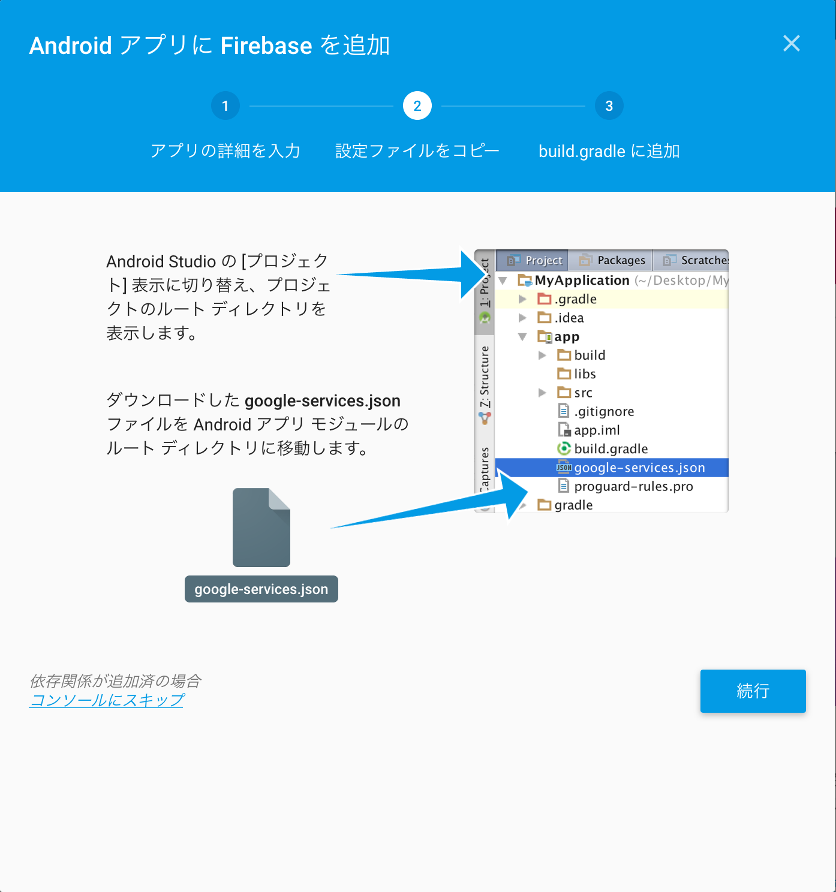
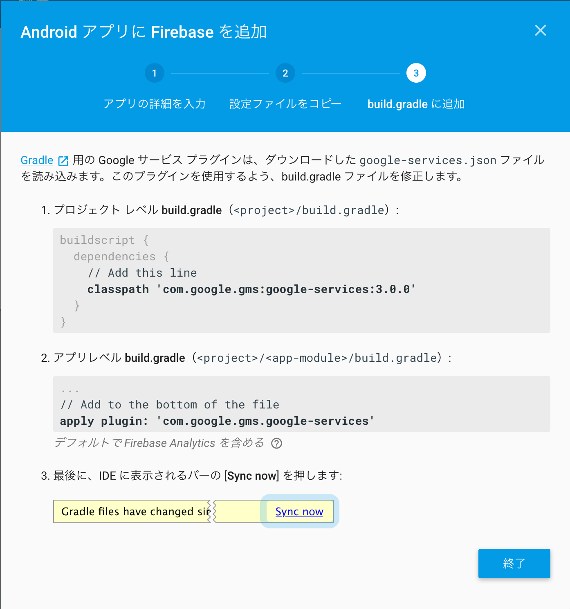

# FirebaseCloudMessagingSample-android
FirebaseCloudMessaging(FCM)サンプルアプリ

## Androidプロジェクトの実装方法




## FCM実行方法

```con
curl --header "Authorization: key=$api_key" \
     --header Content-Type:"application/json" \
     https://fcm.googleapis.com/fcm/send \
     -d "{\"to\": \"/topics/news\",\"notification\": {\"text\": \"メッセージ\"}}"
```
* `$api_key` FCMのサーバーAPIキー
* `/topics/news` デバイスのトークンID

